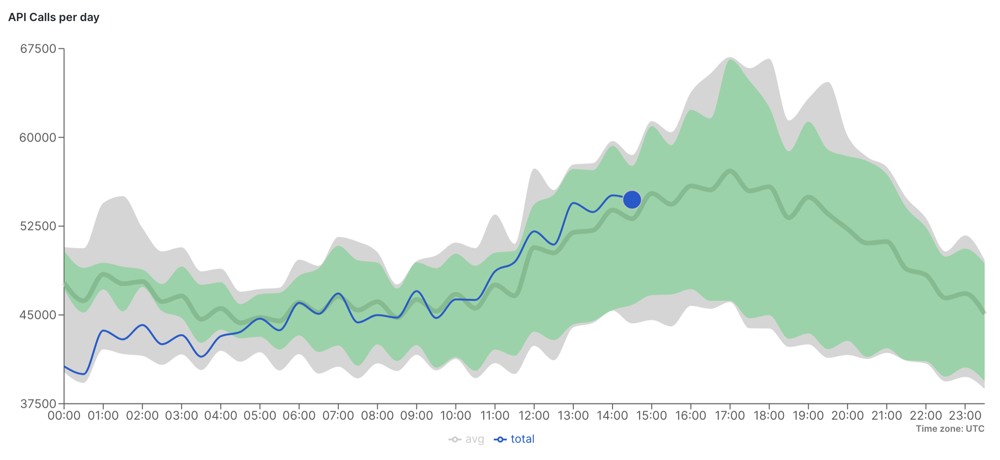
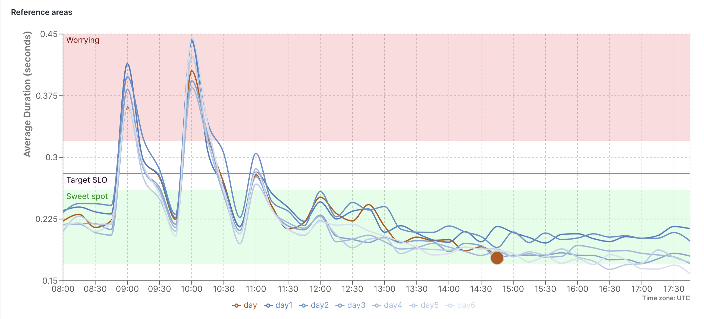

<a href="https://opensource.newrelic.com/oss-category/#new-relic-experimental"><picture><source media="(prefers-color-scheme: dark)" srcset="https://github.com/newrelic/opensource-website/raw/main/src/images/categories/dark/Experimental.png"><source media="(prefers-color-scheme: light)" srcset="https://github.com/newrelic/opensource-website/raw/main/src/images/categories/Experimental.png"></picture></a>


# Historical Multi-series Comparison

This custom visualisation solves multiple different use cases. Its primary use case is to allow a timeseries query to be displayed alongside the same query from historical periods. A bit like `compare with` but supporting more than one comparison period. 

The reference use case is for reviewing order rates across the day. It answers the question: how are the order rates *today* tracking against the rates from historical weeks? We render a 'sleeve' that represents the normal traffic for those previous periods excluding outliers allowing the user to see if the current day's behaviour is tracking normally compared with the past.




## Installation

Install dependencies:
```
npm install
```

Run the following after **ensuring you have selected your nr1 profile** with `nr1 profiles:default`:

Generate a UUID (only do this once):
```
nr1 nerdpack:uuid -gf 
```

Publish to New Relic:
```
nr1 nerdpack:publish
```

Subscribe your account:
```
nr1 subscription:set
```

You should now find the custom visualisation in the "Custom Visualisations" app.

## Getting Started

# Features
Sometimes it's hard to stop adding really useful features! This visualisation can solve a variety of use cases by combining various features we've added:

- Multiple period comparison
- Combined data sleeves: max min, trimmed and outlier clipped
- Relative and time anchored time of day querying (including look ahead! (see below))
- Clock change realignment
- Configurable render-time timezone support 
- User specified and automated auto-refresh
- Configurable Y axis limits
- Multiple user specified colour reference lines
- Multiple user specified colour reference areas
- CSV export
- Grid and colour scheme theme options

### What's "look ahead" ?
This is the term we use to describe a chart who's end time in the future. This is particularly useful if you want to view how a value is tracking compared to previous historical data as you can see what's coming up. We support this by providing either a start/end time of day or a start/end time relative to now.

e.g. Setting time of day to 8am to 6pm will cause data for 'now' to  gradually move from left to right over the day. 
e.g. Providing a start/end time relative to 'now' which creates a similar effect that gradually scrolls the comparison period right to left with the data for 'now' remaining in a fixed position.

## Configuration 
The configuration settings are grouped by function. Each setting and its function is described below. Most can be used together, some take precedents. 

### Data Source Settings
These settings control the source of the data via an NRQL query:

- **Account ID:** Choose the account you wish to query against
- **Query:** An NRQL query. Do not include TIMESERIES or any since/until clauses as these are added by the visualisation.
- **Timezone:** Select the timezone to use for both querying and display. The visualisation is not aware of user preferences in this regard. Default: UTC
- **Re-align clock changes:** When historical data is aligned if the data appears to be in different daylight saving time zones the visualisation will adjust the queried data to try and accommodate. i.e. 8am GMT should be aligned to 8am BST and not be rendered 1 hour adrift.  

### Time Window Settings
These settings control the time window of data to query and display. These can be combined serving a variety of use cases. End times may be set in the future!

- **Start / End (unixtime seconds):** Allows you to specify a fixed start and end time using unixtime. (We should probably remove this one!)
- **Start / End offset from now (period):** Specify the start and end time relative to now. Duration should be specified using [ISO 8601](https://en.wikipedia.org/wiki/ISO_8601#Durations) duration syntax (e.g. "7D", "T1H", "T15M", "1DT6H30M")
- **Start / End today time (hhmm):** Specify the start and end time as an hour/minute of today. e.g. "0830"
- **Week from:** Show a full week, starting on the day specified.
- **Duration (period):** Specify the duration of the data window. Will be relative to any given start/end time provided above. If no start or end time has been provided it will be relative to 'now'.


### Historical lookback
These settings control how previous windows of data are gathered.

- **Compare periods (number):** Specify how many additional historical previous periods of data to query.   
- **Compare step size (period):** Specify how far apart each period should be. For instance to compare with rolling weeks specify "7D", or for daily comparisons "1D, and hourly "T1H"


### Layer options
These settings control how sleeved layers and series data are displayed. Only historical periods are included in the calculations.

- **Show historical:** If this is enabled then the historical periods are queried and used to build the sleeves but their individual series plots are hidden from the chart.
- **Average:** Display a mean average line. 
- **Min Max Area:** Plot a sleeve that indicates the maximum and minimum of the historical data.
- **Trimmed Area & Trim Percentage:** Displays a similar sleeve to max/min but allows it to be reduced by a specified percentage.
- **Clipped Area & Clip size:** These settings control the clipped sleeve. This shows the min/max of the historical period but removes the largest and smallest values. This helps smooth out outliers from the chart.

### Reference areas
These settings allow you to render reference areas and lines on the chart to indicate thresholds etc. You can provide multiple lines/areas as required. 

- **Name:** The name of the area/line which acts as its label (can be omitted)
- **Lower Y value:** The Y value of the chart to draw the line, or for areas on the lower edge. If blank for areas then the minimum value of the chart will be used automatically.
- **Upper Y value:** Only for areas. Sets the upper edge of the area. If blank the area will be drawn to the top of the chart.
- Color (css): Colour for the area/line in [CSS colour syntax](https://www.w3schools.com/cssref/css_colors.php). Alpha channels are supported. e.g. "#00ff0033" for semi transparent green. e.g. "red" for very bright ghastly red.


### Display options
These settings control the appearance of the chart.

- **Refresh rate (s):** The number of seconds to wait before reloading data. Set to zero to prevent auto-reloading. Leave blank to allow for auto-reloading based on window size which is: every 10 seconds for <= 1 minute, every 30 seconds for <= 5 minutes, every minute for < 1 hour and every 5 minutes otherwise.
- **Decimal point rounding:** Specify the number of decimal places to round values to (default 4)
- **Datetime string format for x axis and CSV:** Allows you to configure the display of the date values on the X axis. If not provided the format will automatically be determined based upon window size.
- **Datetime string format for tooltip:** Allows you to specify how the date in the tooltip is displayed
- **Show dots:** Renders dots on the chart
- **Y Axis Label:** lets you specify the Y axis label
- **Y axis max:** Allows you to set the maximum value of the Y axis. Data will be clipped.
- **Y axis min:** Allows you to set the minimum value of the Y axis. Data will be clipped.
- **Display tooltip:** Enable the tooltip display
- **Display legend:** Enable the legends display
- **Dark mode color blending:** Blends visualization colors with New Relic colors to be used only when dark mode is in use
- **Top Margin:** Configure top margin
- **Bottom Margin:** Configure bottom margin
- **Right Margin:** Configure right margin
- **Left Margin:** Configure left margin
- **Display grid:** Enable the grid display
- **Colour theme:** Choose your favourite colour scheme
- **Alignment:** Controls how data is aligned. (Should be removed!)

# Support

New Relic has open-sourced this project. This project is provided AS-IS WITHOUT WARRANTY OR DEDICATED SUPPORT. Issues and contributions should be reported to the project here on GitHub.

>We encourage you to bring your experiences and questions to the [Explorers Hub](https://discuss.newrelic.com) where our community members collaborate on solutions and new ideas.

# Contributing

We encourage your contributions to improve [Project Name]! Keep in mind when you submit your pull request, you'll need to sign the CLA via the click-through using CLA-Assistant. You only have to sign the CLA one time per project. If you have any questions, or to execute our corporate CLA, required if your contribution is on behalf of a company, please drop us an email at opensource@newrelic.com.

**A note about vulnerabilities**

As noted in our [security policy](../../security/policy), New Relic is committed to the privacy and security of our customers and their data. We believe that providing coordinated disclosure by security researchers and engaging with the security community are important means to achieve our security goals.

If you believe you have found a security vulnerability in this project or any of New Relic's products or websites, we welcome and greatly appreciate you reporting it to New Relic through [HackerOne](https://hackerone.com/newrelic).

# License
Historical Multi-series Comparison is licensed under the [Apache 2.0](http://apache.org/licenses/LICENSE-2.0.txt) License.
Historical Multi-series Comparison also uses source code from third-party libraries. You can find full details on which libraries are used and the terms under which they are licensed in the third-party notices document.

